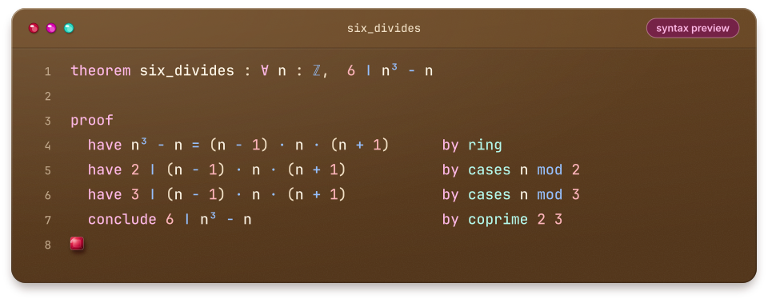

<p align="center">
  
</p>

<p align="center">
  <a href="LICENSE"></a>
  
  <a href="CONTRIBUTING.md"></a>
  <a href="CODE_OF_CONDUCT.md"></a>
</p>

<p align="center">
  <b>Prove things about numbers: rigorously, readably, and with a little help from the machine.</b>
</p>

<p align="center">
  <a href="#why-inceptron">Why Inceptron?</a> &nbsp;·&nbsp;
  <a href="#a-taste-of-inceptron">A taste</a> &nbsp;·&nbsp;
  <a href="#roadmap">Roadmap</a> &nbsp;·&nbsp;
  <a href="#get-involved">Get involved</a>
</p>

<p align="center"></p>

## Welcome

**Inceptron** is a new theorem prover built for **advanced arithmetic**: the natural numbers, the integers, the rationals, and everything you can say about them, from divisibility and congruences to inequalities and induction.

The goal is simple to state and fun to chase: when you know *why* a statement about numbers is true, writing a machine-checked proof of it should feel as natural as explaining it on a whiteboard.

> [!NOTE]
> Inceptron is brand new. There is no code to run yet, and the design is happening in the open. This is the best time to share ideas and help shape what it becomes.

## Why Inceptron?

<table>
  <tr>
    <td width="50%" valign="top">
      <h3><br>Arithmetic first</h3>
      Numbers are the main focus, not one library among many. ℕ, ℤ, ℚ, divisibility, modular arithmetic and inequalities are built in.
    </td>
    <td width="50%" valign="top">
      <h3><br>Small, trusted core</h3>
      A minimal kernel checks every proof, so the amount of code you have to trust stays small.
    </td>
  </tr>
  <tr>
    <td width="50%" valign="top">
      <h3><br>Automation that shows its work</h3>
      Decision procedures handle the tedious steps, and each one produces a proof the kernel can check.
    </td>
    <td width="50%" valign="top">
      <h3><br>Proofs you can read</h3>
      Proof scripts should read like the argument a mathematician would give.
    </td>
  </tr>
</table>

## A taste of Inceptron

<p align="center">
  
</p>

> [!IMPORTANT]
> This is an illustration of the direction, not working code. The syntax is still being designed.

Three consecutive integers always include a multiple of 2 and a multiple of 3, so 6 divides their product. Each `by` step hands a small, well-defined job to the machine, and you can read the whole argument from top to bottom.

<details>
<summary>Show the proof as plain text</summary>

```text
theorem six_divides : ∀ n : ℤ,  6 ∣ n³ − n

proof
  have n³ − n = (n − 1) · n · (n + 1)      by ring
  have 2 ∣ (n − 1) · n · (n + 1)           by cases n mod 2
  have 3 ∣ (n − 1) · n · (n + 1)           by cases n mod 3
  conclude 6 ∣ n³ − n                      by coprime 2 3
∎
```

</details>

## Roadmap

A first sketch. It will change as the design takes shape, and suggestions are welcome.

- [x] Set up the repository and community guidelines
- [ ] Design document: logic, kernel and proof format
- [ ] Minimal proof-checking kernel
- [ ] Parser and pretty-printer for the proof language
- [ ] Core arithmetic library: ℕ, ℤ, ℚ, divisibility, congruences
- [ ] Decision procedures for linear arithmetic and modular reasoning
- [ ] Interactive mode and editor support
- [ ] Documentation site with tutorials and worked examples

## Getting started

There's nothing to install yet. To follow along:

- **Star** the repository to bookmark it.
- **Watch → Custom → Releases** to hear about the first release.

## Get involved

Inceptron is just getting started, so contributions now have an outsized effect. You don't need to be an expert in logic to help:

- **Share an idea**, or a theorem you'd love to prove, by [opening an issue](https://github.com/aironahiru/r7n_inceptron/issues/new/choose).
- **Point us to prior art**: papers, tools and techniques we should learn from.
- **Report problems** as soon as there is something to break.
- **Contribute changes**: the [contributing guide](CONTRIBUTING.md) explains how.

Everyone taking part is expected to follow our [Code of Conduct](CODE_OF_CONDUCT.md).

## License

Inceptron is released under the [Apache License 2.0](LICENSE).

<p align="center"></p>

<p align="center">
  <br>
  <sub>Made with ∎ by <a href="https://github.com/aironahiru">@aironahiru</a> and contributors · <a href="assets/README.md">Brand &amp; palette</a></sub>
</p>
