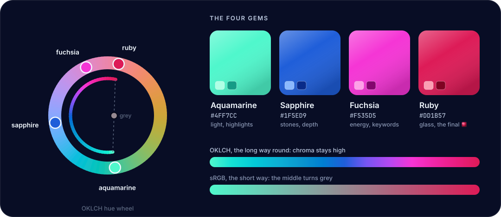

# Inceptron brand guide

  

## The mark

Nested glass panes, each turned 12° further than the last, close in on a **ruby-glass ∎**, the symbol that ends a proof. It is a picture of how proofs work: every proof is built from smaller proofs, all the way down to the kernel, and every one of them ends in ∎.

## The four gems

Each colour has one job.

| Gem | Hex | OKLCH | Role |
| --- | --- | --- | --- |
| **Aquamarine** | `#4FF7CC` | `oklch(0.88 0.15 172)` | Light. Highlights, the turnstile ⊢, tactic names. |
| **Sapphire** | `#1F5ED9` | `oklch(0.52 0.20 262)` | Stones and depth. The background field and the faceted gems. |
| **Fuchsia** | `#F535D5` | `oklch(0.68 0.27 336)` | Energy. Keywords and glow. |
| **Ruby** | `#DD1B57` | `oklch(0.58 0.22 12)` | Glass. The ∎ that closes every proof. |

Neutrals are tinted toward sapphire so they belong to the palette instead of sitting outside it:

| Name | Hex | Use |
| --- | --- | --- |
| Night | `#030615` | Deepest background |
| Night 2 | `#080D25` | Background, badge labels |
| Surface | `#0F172D` | Panels and pills |
| Pearl | `#F1F8FF` | Wordmark and primary text |
| Mist | `#BECBE2` | Secondary text |
| Dim | `#5D6981` | Line numbers and other decoration only |

## Colour theory

**Hue structure.** On the OKLCH hue wheel the gems sit at 172° (aquamarine), 262° (sapphire), 336° (fuchsia) and 12° (ruby). Aquamarine and ruby are near-complements, about 160° apart, which makes them the strongest contrast in the palette. That pair is saved for the two ends of the story: the ⊢ that opens a statement and the ∎ that closes its proof.

**Gradients go the long way round.** Blending two near-complements directly in sRGB passes through grey: the midpoint of aquamarine and ruby is a muddy `#968991`. The signature gradient instead travels round the wheel through sapphire and fuchsia. It is interpolated in OKLCH with 13 stops, so it stays vivid the whole way. The bottom of the palette sheet shows both versions side by side.

**60 · 30 · 10.** About 60% of any piece is sapphire-tinted night, about 30% is sapphire and fuchsia light (glows, panes, keywords), and about 10% is the high-contrast accents, aquamarine and ruby.

**One light source.** Every material is lit from the top left. Ruby glass has a dark core, a lighter table facet and a specular highlight. Sapphires are brilliant-cut, and each facet's shade comes from the angle between that facet and the light.

**Perceptual lightness.** OKLCH lightness matches how bright colours actually look, so tints and shades of each gem are made by moving lightness alone, with the hue fixed. That keeps each family recognisable from its palest tint to its deepest shade.

## Contrast

Text colours measured against Night (`#030615`), using the WCAG contrast formula:

| Colour | Ratio | WCAG |
| --- | --- | --- |
| Pearl | 18.8 : 1 | AAA |
| Aquamarine | 14.9 : 1 | AAA |
| Mist | 12.3 : 1 | AAA |
| Fuchsia light `#FDA0E7` | 10.9 : 1 | AAA |
| Ruby light `#FA9FB3` | 10.3 : 1 | AAA |
| Sapphire light `#8BB9FD` | 10.1 : 1 | AAA |

Base ruby and fuchsia are used for shapes and glows, not small text. Where white text sits on a gem colour, as in the README badges, the colour is deepened until it passes AA (4.5 : 1). That's why the status badge uses `#D50FB9` rather than base fuchsia.

## Typography

- **Wordmark:** Inter Display Bold, tracking −1.8%
- **Text:** Inter Medium and SemiBold
- **Code and maths:** JetBrains Mono Medium

All text in the artwork is converted to outlines, so it looks identical on every device. Both typefaces are released under the SIL Open Font License.

## Files

| File | Use |
| --- | --- |
| `banner.svg` | README header. Gently animated; the animation stops for viewers who have asked their system for reduced motion. |
| `logo.svg` | Square logo and avatar |
| `social-preview.jpg` | Link preview image (1280 × 640). Upload it in **Settings → General → Social preview**. |
| `social-preview.svg` | Source for the JPEG |
| `proof-card.svg` | The proof illustration in the README |
| `icons/*.svg` | Feature icons, one gem each |
| `divider.svg` | Section divider |
| `palette.svg` | The palette sheet at the top of this page |
